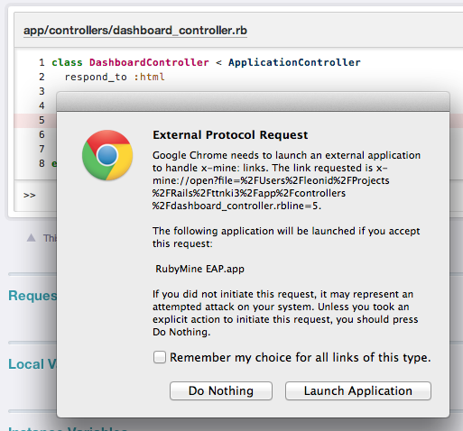

There is a great and very useful gem called [BetterErrors](https://github.com/charliesome/better_errors "BetterErrors"). You can see what makes it so useful and wonderful [in the screencast](http://railscasts.com/episodes/402-better-errors-railspanel) on RailsCasts.com, and you will learn about RailsPanel along the way. The same screencast mentions one of the most useful features of this gem: opening the file and the line where the error happened straight from the browser, with a mouse click. Unfortunately, out of the box only TextMate supports this feature, and Sublime Text 2 with a bit of tinkering.

Until recently the problem could be partially solved in RubyMine with the [Remote Call](http://plugins.jetbrains.com/plugin/?webide&pluginId=6027 "Remote Call") plugin. Partially, because clicking the link did open the right file, but the focus did not switch to the RubyMine application, so you had to go back to the IDE manually, which is not that convenient.

However, just a few days ago [RubyMine ICHII (EAP)](http://confluence.jetbrains.com/display/RUBYDEV/RubyMine+EAP) came out with announced support for the [RubyMine Heaven](https://github.com/pehrlich/rubymine_heaven "RubyMine Heaven") gem, and thanks to that you can now use the BetterErrors features to the fullest.

So, to enable jumping from the browser to the file with the error in RubyMine, you need to do the following simple sequence of steps:

1.  install RubyMine ICHII (EAP or later);

2.  install BetterErrors into your application (see the screencast and GitHub);

3.  put this in the BetterErrors settings:

    ```ruby
    BetterErrors.editor = 'x-mine://open?file=%{file}&line=%{line}'
    ```

In particular, in my Rails project it looks like this:

```ruby
# config/environments/development.rb

config.after_initialize do
  if defined? BetterErrors
    BetterErrors.editor = 'x-mine://open?file=%{file}&line=%{line}'
  end
end
```

That is the whole setup. The first time you click a link on the error page, the browser (both Chrome and Firefox) will ask you something like this:



Tick the checkbox, click "Launch Application", and enjoy the extra comfort while debugging. Happy coding! ;)

## Update, March 29, 2013

I removed the following steps from the post, as it turns out they were completely unnecessary: I simply misread the RubyMine release notes. Thanks to Denis Ushakov for clearing this up for me in the comments!

Once again: you do NOT need to do the steps below. I am leaving them here just for the record.

- install the RubyMine CLI launcher: `Tools` > `Create Command-line Launcher...`

- create a protocol handler in AppleScript Editor:
  - launch AppleScript Editor;

  - paste in the following code:

    ```applescript
    on open location this_url
        do shell script ("mine_handler '" & this_url & "'")
    end open location
    ```

  - save it all as an **Application** (where and under what name does not really matter, you can put it in *Applications* as `RubyMineHandler.app`);

- open the `Package Contents` of the application you just saved: right-click the application in Finder, then choose `Show Package Contents`;

- in the folder that opens, open the `Info.plist` file in any editor;

- add this to the end of the root `dict`:

  ```xml
     <key>CFBundleURLTypes</key>
      <array>
          <dict>
              <key>CFBundleURLName</key>
              <string>RubyMine Handler</string>
              <key>CFBundleURLSchemes</key>
              <array>
                  <string>x-mine</string>
              </array>
          </dict>
      </array>
  ```
