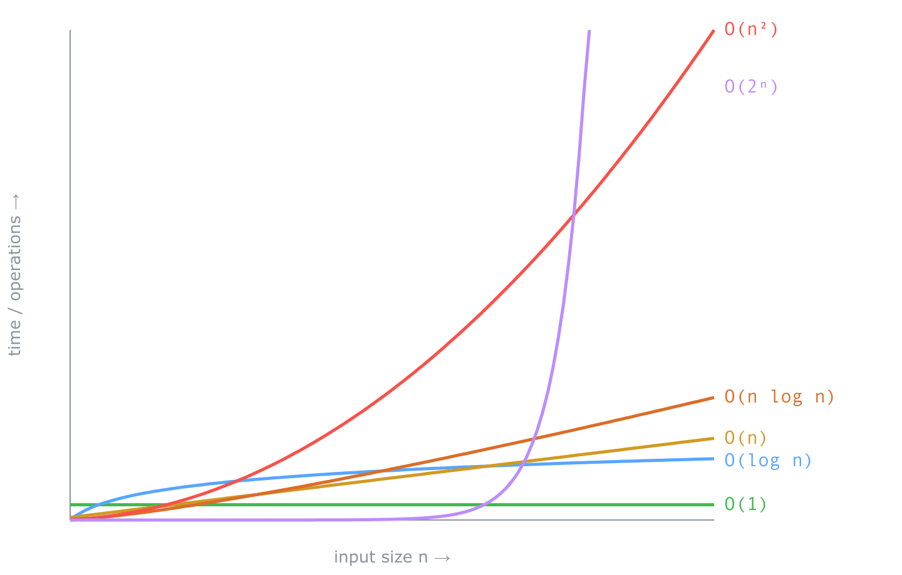

A very common way Ruby code gets slow at scale hides in a line that looks harmless:

```ruby
records.select { |r| seen.include?(r.id) }
```

If `seen` is an Array, that is O(n²). Every one of the `n` records triggers an `include?` that scans up to `n` elements. It runs fine on the hundred rows you tested and falls over on the hundred thousand you didn't. You can see this coming, and you don't have to squint at the code to do it. You can measure the growth rate directly and watch it bend upward.

That is what this post is about. Not the theory of Big O from a chart of curves, but Big O as something you can put on a clock. We are going to take real Ruby, run it on inputs that keep doubling, time each run, and let the complexity class fall out of the numbers, one at a time. By the end you will have measured O(1), O(log n), O(n), O(n log n), O(n²), and O(2ⁿ) with your own hands. And you will know exactly when the measurement is lying to you, because that turns out to be the harder and more useful half.

I went looking for a `BigO.measure { some_code }` method, half expecting to build it. It already exists, it has been sitting on RubyGems since 2020, and the interesting part is how confidently it can be wrong.

## The whole idea: double the input, watch the clock

Big O describes how the work grows as the input grows. Not how long something takes, but how the time *scales*. O(n) means double the input and the work roughly doubles. O(n²) means double the input and the work goes up about fourfold. O(1) means the input size doesn't matter at all.

That "double the input" is the whole measurement technique, and it is older than any gem. It is called the doubling hypothesis, and it is exactly what Princeton teaches in its algorithms course. Run your code at some size `n`, then at `2n`, and look at the ratio of the two times:

| Time ratio when you double n | Growth class |
|---|---|
| stays flat (~1×) | O(1) |
| creeps up by a constant | O(log n) |
| ~2× | O(n) |
| a bit more than 2× | O(n log n) |
| ~4× | O(n²) |
| squares each step | O(2ⁿ) |

If you do this across a wide range of sizes and fit the points to the curve `time = a · n^b`, the exponent `b` is the growth rate. Fit a straight line through the same points on log-log axes and its slope is that same `b`. That is the entire trick: measure at many sizes, fit a power curve, read the exponent. A linear algorithm gives `b ≈ 1`. A quadratic one gives `b ≈ 2`. Everything else lands somewhere you can read off a ruler.

There is a gem that does the fitting for you. Before we let it, let's do it by hand once, so nothing about the result is magic.

## Every class, measured

The tool is [`benchmark-trend`](https://github.com/piotrmurach/benchmark-trend) by Piotr Murach. Add it to a Gemfile with `gem "benchmark-trend"` and `bundle install`. It gives you two pieces: `Benchmark::Trend.range` to build a geometric ladder of sizes (with `ratio: 4`, each size is four times the last: 1000, 4000, 16000, and so on up to the max), and `Benchmark::Trend.infer_trend` to run your code at each size and fit the curves.

One thing matters before we start, and it is the mistake everyone makes first. `infer_trend` times the *entire block* you give it. If you build your test data inside that block, you are timing the setup too, and the setup usually has its own complexity that swamps what you meant to measure. So build the input for each size first, then time only the operation. Here is a small helper that does exactly that:

```ruby
require "benchmark/trend"

# sizes:   the geometric range of input sizes
# prepare: builds the input for a given size, once, before timing
# work:    the operation whose growth we're measuring
def measure(sizes, prepare:, &work)
  inputs = sizes.map { |n| prepare.call(n) }

  trend, fits = Benchmark::Trend.infer_trend(sizes, repeat: 4) do |n, i|
    work.call(inputs[i], n)
  end

  r2 = fits[trend][:residual]      # how well the winning curve fit (R², 0 to 1)

  if trend == :exponential
    # A compounding curve has no polynomial exponent to read, so skip it.
    puts "best fit: #{trend}  (compounding growth)  R2=#{format('%.4f', r2)}"
  else
    b = fits[:power][:slope]       # the power-law exponent: our growth "ruler"
    puts "best fit: #{trend}  exponent b=#{format('%.2f', b)}  R2=#{format('%.4f', r2)}"
  end
end
```

Two blocks are in play here, and it helps to keep them straight. The one `infer_trend` calls receives `(n, i)`, the size and its index, and uses `i` to pick the matching pre-built input. The block *you* write and pass to `measure` receives that prepared input as its first argument and the size `n` as its second, so you will see signatures like `|array, n|` below (and `_n` when a demo doesn't need the size). Either way, `work.call(...)` is the timed part, never the setup. Save this helper as `measure.rb`; every demo below opens with `require_relative "measure"`, and each is a complete, runnable file once `benchmark-trend` is installed.

(`repeat: 4` runs each size four times and averages, to smooth out noise.) Read two numbers out of every run. The `best fit` is the curve family the gem picked. The exponent `b` is the growth ruler: near 0 is flat, near 1 is linear, near 2 is quadratic. For an exponential curve there is no meaningful polynomial exponent, so the helper skips it and the family name carries the result.

### O(1): the lookup that doesn't care how big the haystack is

Start with the class that feels like magic the first time you see it. A Hash lookup takes about the same time whether the Hash holds a thousand keys or a million:

```ruby
require_relative "measure"

LOOKUPS = 200_000
sizes = Benchmark::Trend.range(1_000, 1_000_000, ratio: 4)

measure(
  sizes,
  # Build a Hash of n keys, plus a fixed batch of keys to look up.
  prepare: ->(n) {
    hash = (1..n).to_h { |k| [k, true] }
    keys = Array.new(LOOKUPS) { rand(1..n) }
    [hash, keys]
  }
) do |(hash, keys), _n|
  keys.each { |k| hash[k] } # always LOOKUPS lookups, no matter how big the Hash
end
```

The batch is a fixed 200,000 lookups at every size. The Hash grows from a thousand keys to a million; the amount of work does not. Run it:

```text
best fit: linear  exponent b=0.26  R2=0.9976
```

The exponent is 0.26, way below linear's 1. Flat-ish. It is not exactly 0, and the leftover is the machine, not the algorithm: most likely the Hash spilling out of CPU cache as it grows, so each lookup gets a little slower, though a single run can't cleanly separate that from noise or GC.

This is also the shakiest measurement in the post, and worth knowing that up front. Rerun it and the exponent bounces around 0.2 to 0.3, and on a busy machine the fitter can even misname the family as `exponential`, because a flat line has no real trend for it to lock onto, so noise wins. That instability is itself the fingerprint of constant time. Hold the thought, because it is our first hint that the clock measures more than complexity. We will come back to it.

### O(log n): binary search halves the problem each step

Logarithmic growth is the one people struggle to picture. It means each step throws away half of what is left, so doubling the input adds just one more step. Binary search on a sorted Array is the textbook case, and Ruby has it built in as `Array#bsearch`:

```ruby
require_relative "measure"

SEARCHES = 200_000
sizes = Benchmark::Trend.range(1_000, 1_000_000, ratio: 4)

measure(
  sizes,
  prepare: ->(n) {
    array   = (1..n).to_a
    targets = Array.new(SEARCHES) { rand(1..n) }
    [array, targets]
  }
) do |(array, targets), _n|
  targets.each { |t| array.bsearch { |x| x >= t } } # ~log2(n) comparisons each
end
```

```text
best fit: power  exponent b=0.12  R2=0.9906
```

An exponent of 0.12: nearly flat, and notice it came in *below* the O(1) run's 0.26, not above. That is not a mistake, it is the lesson arriving early. Logarithmic growth is so slow that on a ruler measuring polynomial degree it sits right down on the floor with constant time, and here noise in the O(1) run even pushed it higher than the log one. Going from a thousand to a million elements, a 1000× jump, only about tripled the depth of each search. The takeaway to bank: O(1) and O(log n) both read as "small exponent, nearly flat," and timings alone cannot reliably tell them apart or even order them. We will make that a rule later.

### O(n): the linear scan from the opening

Now the line that started this post. `Array#include?` walks the array element by element until it finds a match. Search for something that isn't there and it has to touch all `n` elements:

```ruby
require_relative "measure"

sizes = Benchmark::Trend.range(1_000, 1_000_000, ratio: 4)

measure(
  sizes,
  prepare: ->(n) { (1..n).to_a }
) do |array, n|
  array.include?(n + 1) # absent value, so the scan can't stop early
end
```

```text
best fit: linear  exponent b=0.96  R2=1.0000
```

Exponent 0.96, an R² of 1.0, and this time the gem named the family `linear` outright. Double the array and the scan takes twice as long. This is the shape hiding inside that `select` from the opening, and in a moment we will see what happens when you nest it.

### O(n log n): sort, and a first look at trouble

Sorting is the workhorse of the "slightly worse than linear" class. Ruby's `Array#sort` is a quicksort variant, average O(n log n):

```ruby
require_relative "measure"

sizes = Benchmark::Trend.range(1_000, 1_000_000, ratio: 4)

measure(
  sizes,
  prepare: ->(n) { (1..n).to_a.shuffle } # fresh shuffle so each sort starts unsorted
) do |array, _n|
  array.sort
end
```

```text
best fit: power  exponent b=1.09  R2=0.9998
```

Look closely, because this is the crux of the whole post. The exponent is 1.09. Not 2. Barely above the linear scan's 0.96. Sorting is genuinely O(n log n), meaningfully more work than a linear pass, and the measurement can barely tell the difference. The log factor is nearly invisible to a power fit. That is not a flaw in this gem; it is a limit of the technique itself, and it has a whole section coming. For now, just notice that O(n) and O(n log n) landed almost on top of each other: 0.96 and 1.09.

### O(n²): the accidental one

Here is the opening bug, built on purpose. Filter `n` rows, and for each row do an `include?` scan over an `n`-element Array. That is `n` rows times an `n`-element scan:

```ruby
require_relative "measure"

sizes = Benchmark::Trend.range(500, 8_000, ratio: 2) # smaller: n² gets big fast

measure(
  sizes,
  prepare: ->(n) {
    rows = (1..n).to_a
    seen = (n + 1..2 * n).to_a # values that are absent, forcing a full scan
    [rows, seen]
  }
) do |(rows, seen), _n|
  rows.select { |r| seen.include?(r) }
end
```

```text
best fit: power  exponent b=1.99  R2=1.0000
```

Exponent 1.99, near enough to 2. That is quadratic, plain as day, and it is the number that separates a page that loads instantly from one that times out. Swap that Array for a Set and the exponent drops back toward 1, because a Set is Hash-backed and its `include?` is average O(1). That is why a Set is the right structure for a membership check, and we will gate exactly this difference in CI later.

### O(2ⁿ): the one that ends the party

Exponential growth is the cliff. Each `+1` to the input roughly doubles the work. The classic offender is naive recursive Fibonacci, where every call spawns two more:

```ruby
require_relative "measure"

def fib(n) = n < 2 ? n : fib(n - 1) + fib(n - 2)

# Exponential workloads need small, closely-spaced sizes, not a wide sweep.
# infer_trend accepts any array of sizes, not just Trend.range output.
sizes = (20..32).step(2).to_a

measure(sizes, prepare: ->(n) { n }) do |n, _i|
  fib(n)
end
```

```text
best fit: exponential  (compounding growth)  R2=0.9999
```

The gem names it `exponential` and I skip the power exponent here, because for a compounding curve the polynomial ruler is meaningless. This is why `fib(50)` would outlast your patience while `fib(30)` returns instantly. The sizes only go to 32 for a reason.

Here is the whole ladder from one run, so you can see the ruler climb:

```text
O(1)  Hash#[]          best fit: linear  exponent b=0.26  R2=0.9976
O(log n)  bsearch      best fit: power  exponent b=0.12  R2=0.9906
O(n)  include?         best fit: linear  exponent b=0.96  R2=1.0000
O(n log n)  sort       best fit: power  exponent b=1.09  R2=0.9998
O(n^2)  select+incl    best fit: power  exponent b=1.99  R2=1.0000
O(2^n)  fib            best fit: exponential  (compounding growth)  R2=0.9999
```

Your exact numbers will differ, because this is a stopwatch on a real machine. Even the order at the flat end can wobble, as O(1) and O(log n) just did. What holds is the climb once there is real growth to see: near-flat, then a linear ramp near 1, then a quadratic wall near 2, then off the exponential cliff. Here is the same story as curves:



## The one-call version, and its rough edges

You do not need the helper. The core of `benchmark-trend` is a single call, and it is worth seeing raw:

<!-- verify-blocks: group=raw-api -->
```ruby
require "benchmark/trend"

sizes  = Benchmark::Trend.range(1_000, 1_000_000, ratio: 4)
arrays = sizes.map { |n| (1..n).to_a }

trend, fits = Benchmark::Trend.infer_trend(sizes, repeat: 4) do |_n, i|
  arrays[i].include?(-1) # absent value, so the scan is O(n)
end

puts "best fit: #{trend}"
puts "residual (R2): #{fits[trend.to_sym][:residual].round(4)}"
```

```text
best fit: linear
residual (R2): 0.9999
```

`infer_trend` returns the winning family as a Symbol and a Hash of every fit it tried. That is genuinely close to the `BigO.measure { }` I went looking for. But it has three edges worth knowing before you trust its output, and none of them are in the README's happy path.

**It fits four curve families, and quadratic isn't one of them.** The candidates are exponential, power, linear, and logarithmic. There is no dedicated `n²` model and no `n log n` model. This is why we read polynomial degree off the *power* fit's exponent instead of expecting a name like "quadratic." An exponent near 2 is how quadratic shows up. If you were hoping the tool would just print "O(n²)," it can't, and now you know why.

**The residual is R², and higher is better.** In the output above, `residual: 0.9999` means the linear curve explained almost all the variance in the timings. Values run from 0 (useless) to 1 (perfect). Treat anything under about 0.9 as "the fit didn't take, don't trust the label." Strictly, the gem picks the winner on R² *and* a small penalty for model complexity, so a fancier curve has to earn its win rather than edge ahead on a rounding error, but R² is the number you read.

**The human-readable trend string has a bug.** Every fit carries a pretty-printed formula, and for a power fit it prints its two numbers in the wrong slots. Here is a full run against `sort`, which fits a power law, printing the formula next to the real values pulled from the Hash:

```ruby
require "benchmark/trend"

sizes  = Benchmark::Trend.range(1_000, 1_000_000, ratio: 4)
arrays = sizes.map { |n| (1..n).to_a.shuffle }

_trend, fits = Benchmark::Trend.infer_trend(sizes, repeat: 4) do |_n, i|
  arrays[i].sort
end

power = fits[:power]
puts "printed string:   #{power[:trend]}"          # what the gem shows you
puts "slope (exponent): #{power[:slope].round(3)}" # the REAL growth exponent
puts "intercept (coef): #{power[:intercept]}"      # the REAL coefficient
```

```text
printed string:   1.09 * x^0.00
slope (exponent): 1.086
intercept (coef): 3.55684051103109e-08
```

The string reads `1.09 * x^0.00`, which looks like an exponent of zero, a flat line. But the real exponent is 1.086, sitting in the `slope` field, and the tiny coefficient is in `intercept`. The formatter swapped them. The gem's own README shows the same swapped shape in its example output, so this is not a fluke on my machine. The lesson is simple: read `:slope` and `:intercept` from the Hash, and ignore the pretty string.

Those edges aside, the fitted curve buys you something useful: it can project a runtime at a size you never ran. `Benchmark::Trend.fit_at` takes the slope and intercept from a fit and evaluates the curve at any `n`. Feed it the O(n²) filter's power fit and ask what a hundred thousand rows would cost:

```ruby
power = fits[:power] # from the O(n²) measurement above
at = Benchmark::Trend.fit_at(:power, slope: power[:slope],
                                     intercept: power[:intercept], n: 100_000)
puts "projected time at n=100_000: #{at.round(2)} s"
# => projected time at n=100_000: 31.3 s
```

The absolute seconds are machine-specific and will swing between runs, so trust the order of magnitude, not the decimal. That is the whole reason complexity is worth knowing: an exponent near 2 means roughly ten times the rows costs a hundred times the time, and now you can see the wall before you hit it in production.

One more thing to know up front, not a bug but a fact. `benchmark-trend` last shipped version 0.4.0 in March 2020, and its RSpec companion `rspec-benchmark` shipped 0.6.0 two days later. Neither has had a release since. They still install and run cleanly on Ruby 4.0, which is what every example here runs on, but you are adopting stable, dormant code, and that is worth a conscious choice.

## Where the stopwatch lies

Everything so far makes measurement look easy. It isn't, and the gap between "I measured it" and "I know its complexity" is where people get burned. Four ways the clock misleads you.

**It measures Big Theta, not Big O.** This is the subtle one. Big O is a worst-case upper bound, a promise about the worst input the algorithm could ever face. A stopwatch can't measure a promise. It measures what actually happened on the inputs *you* chose. Feed quicksort already-sorted data and you might see one shape; feed it its pathological worst case and you'll see another. What you get back is the observed order of growth on your workload, which theorists call Big Theta, not the worst-case Big O.

The Python equivalent of this technique, the [`big_O`](https://github.com/pberkes/big_O) package, says so flatly in its own docs: "Strictly speaking, we're empirically computing the Big Theta class." Every demo above quietly chose its inputs. The `include?` scan searched for an *absent* value on purpose, to force the full-length worst case. Change that decision and you change the number.

**It is blind to log factors.** Remember sort landing at 1.09, right next to the linear scan's 0.96? That is not bad luck, it is arithmetic. When you double the input, an O(n) algorithm's time doubles and an O(n log n) algorithm's time slightly-more-than-doubles, and "slightly more" is nearly invisible against measurement noise. Princeton's own course notes put it bluntly: you "cannot identify logarithmic factors with the doubling hypothesis." So a power fit cannot cleanly separate O(n) from O(n log n). If your exponent lands around 1, you have learned it is roughly linear, and to tell linear from linearithmic you have to go read the code. The clock won't do it for you.

**A too-narrow range invents an answer.** Watch the same linear scan, measured over a tiny range of sizes and then a wide one:

```ruby
op    = ->(array, n) { array.include?(n + 1) } # same O(n) scan both times
build = ->(n) { (1..n).to_a }

puts "narrow range (100..800):"
measure(Benchmark::Trend.range(100, 800, ratio: 2), prepare: build, &op)

puts "wide range (1_000..1_000_000):"
measure(Benchmark::Trend.range(1_000, 1_000_000, ratio: 4), prepare: build, &op)
```

```text
narrow range (100..800):
best fit: constant  exponent b=0.60  R2=1.0000
wide range (1_000..1_000_000):
best fit: linear  exponent b=0.96  R2=1.0000
```

Over 100 to 800 elements, a linear scan looks *constant*, with a perfect R² of 1.0 on the wrong answer. (`constant` here is not a fifth family; it is what the gem calls a linear fit whose slope came out flat at zero, and `perform_constant` later is that same zero-slope special case.) At those sizes the scan is so fast that fixed overhead drowns the actual growth. The high R² gives you false confidence in a false label. Only across a wide range, where the real work dominates, does the linear shape appear. The rule the research literature agrees on: your smallest size must be big enough that the operation itself, not the overhead around it, dominates the clock.

**The machine leaks into the measurement.** Garbage collection pauses, CPU cache behavior, other processes, JIT warmup: all of it lands in the timings. The usual teaching model says these effects only shift the constant factor and leave the exponent alone. Mostly true, but not a guarantee. Our own O(1) Hash lookup came back at exponent 0.26 instead of 0, most likely because its memory working set grew past the CPU cache. In a garbage-collected runtime, effects that scale with `n` can bend the exponent itself.

`benchmark-trend` fights back where it can: it uses a monotonic clock, runs `GC.start` before each size, and averages repeated runs when you pass `repeat:`. It does not warm up the code, though, and wall-clock timing in Ruby is noisier than the deterministic operation-counting the academic papers use. Measure the same thing twice and you will get two slightly different exponents. That is normal.

None of this makes the technique useless. It makes it a tool with a manual. You measure to build intuition and to catch regressions, and when two adjacent classes are ambiguous, you fall back to reading the code.

## Gating complexity in CI

Measuring by hand teaches you the shapes. The payoff at work is different: catch the day someone turns your O(n) into an O(n²) without noticing. That is what [`rspec-benchmark`](https://github.com/piotrmurach/rspec-benchmark) is for. It wraps `benchmark-trend` in RSpec matchers, so you assert a growth class the way you assert anything else.

The matchers are `perform_constant`, `perform_logarithmic`, `perform_linear`, `perform_power`, and `perform_exponential`. There is no `perform_quadratic`, for the four-families reason from earlier; a quadratic is a `perform_power` whose exponent lands near 2. Here is a gate on the membership filter from the opening, pinned to a Set so it stays linear:

```ruby
require "benchmark/trend"
require "rspec-benchmark"
require "set"

RSpec.configure { |c| c.include RSpec::Benchmark::Matchers }

SIZES = Benchmark::Trend.range(200, 3_200, ratio: 2)
ROWS  = SIZES.to_h { |n| [n, (1..n).to_a] }
SEEN_SET = SIZES.to_h { |n| [n, (n + 1..2 * n).to_a.to_set] }

RSpec.describe "membership filtering" do
  it "stays linear with a Set" do
    expect { |n, _i| ROWS[n].select { |r| SEEN_SET[n].include?(r) } }
      .to perform_linear.in_range(200, 3_200).ratio(2).sample(100).times
  end
end
```

Two details carry the weight. The block takes `n`, so the work has to scale with `n`: we key the pre-built inputs by size and look them up, exactly like the helper did, so we never time the setup. And `in_range(min, max).ratio(r)` rebuilds the same geometric ladder `Benchmark::Trend.range` would, which is why keying the data by `n` lines up. With `SEEN_SET` a Set, `include?` is average O(1), so filtering `n` rows costs O(n) total and the gate passes green.

Now regress it. Swap that Set back to a plain Array and keep the linear gate:

```ruby
SEEN = SIZES.to_h { |n| [n, (n + 1..2 * n).to_a] } # Array, not Set

it "is supposed to stay linear (but doesn't)" do
  expect { |n, _i| ROWS[n].select { |r| SEEN[n].include?(r) } }
    .to perform_linear.in_range(200, 3_200).ratio(2).sample(100).times
end
```

The same filter is now O(n²), the gate goes red, and it names the class it actually found:

```text
Failures:
  1) membership filtering is supposed to stay linear (but doesn't)
     Failure/Error: expect { |n, _i| ROWS[n].select { |r| SEEN[n].include?(r) } }
       expected block to perform linear, but performed power
```

That "expected linear, but performed power" is the regression caught before production. One honest warning, straight from the gem's own README: these matchers are "potentially flaky." They are timing-based, so a loaded CI machine can occasionally flip a borderline result. Keep them out of your normal suite. Tag them, give them their own run, and lean on them for the classes that are unambiguous, an O(n) that must not become O(n²).

## When to reach for it, and when not

Empirical measurement is a teacher and a smoke alarm, not a proof. Reach for it to build a feel for a method you don't know: put `Array#include?`, `Set#include?`, and `Hash#[]` on the clock and the difference stops being abstract. Ruby's docs rarely state the complexity of built-in methods (`bsearch` is a rare one that spells out O(log n); `include?` and `sort` say nothing), so measuring is often how you find out. And reach for it to guard a hot path in CI, where a `perform_linear` gate on the endpoint that melted last quarter is cheap insurance.

Keep in mind what it does *not* measure: the constant factor. `benchmark-trend` tells you the shape of the curve, not which of two methods is faster at the size you actually run. That second question, "is a Set worth it for my 50 items," belongs to `benchmark-ips` or the stdlib `Benchmark`. The two are complementary, one for the growth, one for the wall-clock at a fixed size.

Then the boundaries. Don't reach for it to prove a worst-case bound; it measures the case you fed it. Don't trust it to split two adjacent classes; when the exponent sits near 1, the clock has told you everything it can, and the code has the rest.

Don't point it at IO, either. Every demo here is pure in-memory CPU work, which is where wall-clock inference behaves. A loop of database queries or network calls has its growth swamped by connection and IO variance, so the exponent turns to mush. For the classic N+1 query, count the queries, don't time the exponent.

And remember a worse Big O can still win at the sizes you actually run. For small `n`, constants and memory layout dominate, which is why hybrid sort implementations fall back to insertion sort on small chunks even though it is O(n²). Big O is the shape of the curve as `n` grows, not the winner at any single size. When it matters, measure the crossover for your own case.

So measure your code. Watch the exponent climb from a flat line to a linear ramp to a quadratic wall. Just keep one hand on the manual, because the clock will tell you a clean story, and sometimes the story is wrong.
