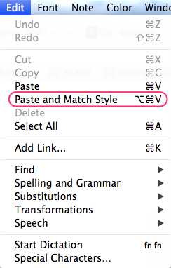
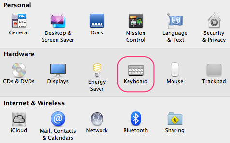
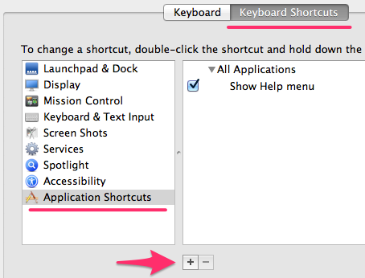
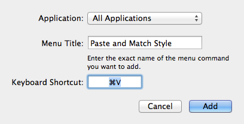
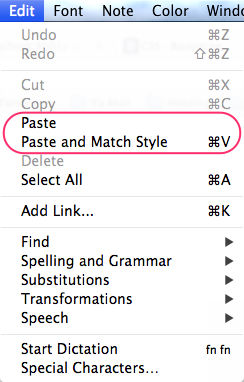

I don't know about you, but it drives me nuts when I copy some text from the browser into another app on Mac OS X and it gets pasted with the site's styling instead of as plain text. The other day it annoyed me so much that I decided to find a fix. And there is one, a simple one, and everything gets sorted without any third-party gizmos or poking around in the terminal.

It's no secret that one option, which requires no setup at all, is the `Cmd+Option+Shift+V` combination, but since I never need to paste with the formatting kept, that option doesn't work for me. I want the standard `Cmd+V` to paste without the source formatting (or, more precisely, to paste in the current style of our app, which is pretty much the same thing).

So, the recipe. My screenshots are of the English Mac OS interface, but I think they're detailed enough for you to repeat this in any language.

**1. Find out what the menu item that does what we need is called**

Almost any app will do, I used Stickies.

The item is called "Paste and Match Style", remember it.

**2. Open System Preferences, then Keyboard**

**3. Pick the "Keyboard Shortcuts" tab**

In the left-hand list select "Application Shortcuts" and click +

**4. Fill in the dialog that appears**

Leave "All Applications" (we want this in every app), in "Menu Title" type what we found in step one, "Paste and Match Style", and set the Keyboard Shortcut to the one used for the standard paste, `Cmd+V`.

Click "Add" and that's it, problem solved.

Now the menu in every app will look roughly like this:

